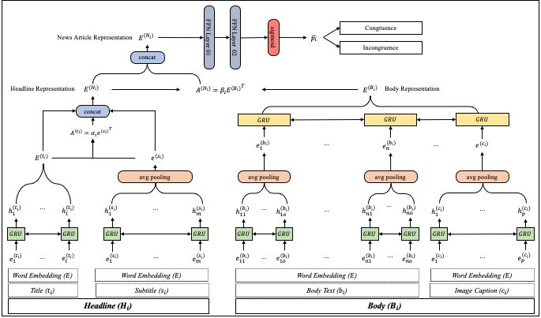

# Detecting Incongruent Headlines News with Auxiliary Textual Information

This is the tensorflow implementation of **Detecting Incongruent Headline News with Auxiliary Textual Information**.

Auxiliary textual information contains subtitle and image caption.

  

## Pre-requisite

* tensorflow 2.4.0
* tensorflow-gpu 2.4.0
* numpy 1.19.4 
* pandas 1.1.5
* konlpy 0.5.2
* gensim 3.8.3
* nltk 3.5
* scikit-learn 0.24.0
* matplotlib 3.3.3

## DATASET

We do not upload word2index.pickle, embedding_matrix.npy, indexed_inputs due to memory issue.

If you want to run testing, we will provide word2index.pickle, embedding_matrix.npy, indexed_inputs for test data.

Please request through [additional src application form](https://forms.gle/PNDn1d1sF7Y5ZY7z7)

We are also providing the dataset(*Incongruent News Headline Dataset*) for non-commercial research purposes only.

Please request through [dataset application form](https://forms.gle/i7wKQCCEVYYQAJzv8)

## Files description

* data : codes for data preprocessing, dataset(*Incongruent News Headline Dataset*) construction, word2index & fasttext embedding matrix & indexed inputs generation
* utils : codes for customized callbacks

## Instructions to run the project

* **Training** python3 main.py --mode train
* **Testing** python3 main.py --mode test
